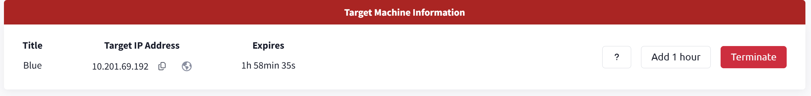

# Blue

# Info

- Author: Huan Phan Canh Dang
- Finish: 08/08/2025
- GitHub: harrybrwnie

# Overview

In the Blue room, you’ll deploy and hack a Windows machine by leveraging common misconfigurations. This isn’t boot-to-root challenge but a beginner-focused, guided exercises idea for reinforcing foundational penetration testing skills

## Learning Objectives

- Reconnaissance: & Enumeration: Identify open ports, services and versions using Nmap and manual exploration
- Vulnerability Exploitation: Utilize the EternalBlue (MS17-010) SMB vulnerability using Metasploit
- Post-Exploitation: Gain a shell, upgrade it to a Meterpreter session, migrate to stable processes, escalate privileges, and extract sensitive data (password hashed, flags)

This room covers the essentials stages of Window pentesting:

- Scanning & Enumeration
- Exploitation via Metasploit
- Privilege Escalation & Credential Dumping
- Pursuing In-Game Flags

# Recon

## Question 1

## Question 2

The nmap result above show that there are 3 ports under 1000 that are running

- 135/tcp
- 139/tcp
- 445/tcp

So the answer is 3

## Question 3

The nmap result also show that there is a vulnerable machine MS17-010

# Gain Access

## Question 1

We can use the Metasploit Framework by using the msfconsole command

## Question 2

We can use the search command in Metasploit to find out what exploit module want to ultilize

There are 2 available modules but due to the vulnerable machine we found on question 1.  The nmap has mentioned about the SMB Server so that it is likely that we will use the exploit/windows/smb/ms17_010_eternalblue.

## Question 3

According to the show options command, we need to set up the RHOSTS parameter (stand for Remote Hosts). The target’s IP is 10.201.69.192 so we use the set command to set it up

## Question 4

## Question 5

After run that module, we get access to the shell.

# Escalate

## Question 1

We use the background command to background our current session and “upgrade” it to the meterpreter by using the sessions -u command

## Question 2

Change to the post/multi/manage/shell_to_meterpreter module and show options

We can see the session parameter is required and we already the session that are running (we had background it before). So that we assign that value for the SESSION parameter

## Question 3

## Question 4

## Question 5

## Question 6

## Question 7

## Question 8

Because in the Metasploit:Meterpreter room, I had migrate to the lsass.exe process and success so in this room I also choose this process and migrate to it

# Cracking

## Question 1

After migrate to the lsass.exe, we use the hashdump command and observe that “Jon” is the user

## Question 2

Use the online tool such as [crackstation.net](http://crackstation.net) to crack the hash password of Jon

We can see the actual password and answer this question.

# Find flag!

## Question 1

Use the pwd command and see that we are at C:\Windows\system32, cd .. twice to get to the C:\ and type the ls to show all directory and files and get the flag1.txt. The only mission now is cat this file

## Question 2

I had asked ChatGPT where password are stored within Windows and get the path is C:\\Windows\System32\config. So I cd to that and ls and see the flag

## Question 3

Simplify the process by using the search command, I can see the both 2 previous flags has the name of rules (flag1.txt, flag2.txt for example). So that in this question I only search for the flag3.txt and find out where it is and cat it out to get the answer.

