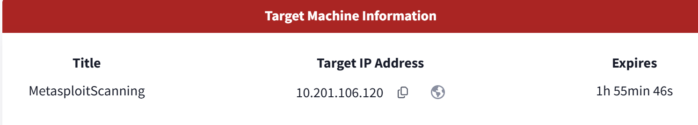

# Metasploit: Exploitation

# Info

- Author: Huan Phan Canh Dang
- Finshed: 08/08/2025
- GitHub: h4rrybrwnie

# Overview

This write-up documents the exploitation of a vulnerable machine using the Metasploit Framework. The goal is to identify open ports, choose an appropriate exploit, deliver a payload, and gain a Meterpreter session.

# Scanning

In the Scanning room, here is the information about the Target Machine, 10.201.106.120 is the IO

## Question 1

The question is “How many ports are open on the target system?”.

For the investigation, I am try to use the nmap command to find out more about out target. Using an IP 10.201.106.120 (MACHINE_TARGET_IP) and the Pn flag to tell nmap that I am pretty sure there are some port are open at that time.

Results:

- Port 21
- Port 22
- Port 139
- Port 445 (SMB-related services)
- Port 8000

→ This result suggest the target is use Window OS and there are 5 port are open.

## Question 2

Question 2 tell us to find out what is the name of NetBIOS

Firstly, we have to use the Metasploit Framework by the msfconsole command

After that, let search for a scanner and bios by using the search command in msfconsole

The result show that there are 2 auxiliary we can use to do the task. Here I am use the auxilary/scanner/netbios/nbname cause the task is asked about the NetBIOS name.

After choosing an approriate method, we have to use the show options command to see and assign some parameter need for the task (each has some different parameter).

The auxiliary/scanner/netbis/nbname has some parameters for us to set is the RHOSTS (now it is blank cause we had not set it yet).

Cause RHOSTS is stand for Remote Hosts so that we assign it to the MACHINE_TARGET_IP is 10.201.106.120 as before.

There is the show options after we had set the parameter

Finally, start with the run command and we can see the Name is ACME IT SUPPORT.

## Question 3

We have to find out what is running on port 8000, so I decided to use the nmap command again but add the sV flag because we want to find out what is the version of it.

We can see that on port 8000, the version is WebFS httpd 1.21 and that is our answer.

## Question 4

The question give us the user’s SMB name is penny and want to know the password of that user.

Due to the hint, we try to use the smb_login module. Firstly, let search for that module in msfconsole.

After choose to use that module, we need to find out what are the parameters we need to set before run the module.

By the image above, we can see some parameters we have known is PASS_FILE, RHOSTS and SMBUser.

After set up all of the parameters, run the module and get the password of penny is “leo1234”.

# Exploitation

## Question 1

Due to the question hint, we need to use the module relevant to the MS17-010 patch.

After select the exploit/windows/smb/ms17_010_eternalblue module in the msfconsole We had to define some parameters for our usage.

Run the module and we can see that the target is vulnerable and our task is completed.

After run the module, we gain the meterpreter.

## Question 2

We need to find some command in the meterpreter shell to use by using the help command and we can see the search command that match our requirement.

Use the search command to find out where is the path to flag.txt and cat the content out

## Question 3

Due to the hint, we use the hashdump command, and we can see the NTLM hash of the password pf pirate user

# Msfvenom

## Question 1

On the target machine, gain the root privileges by by using the sudo su command and type the password

## Question 2

On own machine (here I am using the AttackBox of TryHackMe). Firstly, create an payload in elf format and save it to the rev_shell.elf file and give the executive permission.

## Question 3

On our machine (AttackBox), we run the server for the target machine to access the resources.

We need to “catch” the connection by using the multi/handler Handler module on msfconsole. Set the payload and it parameters by using the command above.

Back to the target machine, get the rev_shell file by using the wget command (our machine are running the server on port 9000)

After get rev_shell, use the chmod command to give permission to run file.

## Question 4

On our machine, run the multi/handler module and catch the connection. If the target machine run the rev_shell.elf file, we can get a meterpreter session

## Question 5

## Question 6

Now, we get a meterpreter session, we can cat the /etc/shadow to show the password hash 

After looking for the user, I can see the claire user. Copy the hash and finish the task

