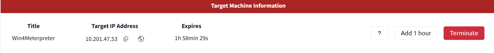

# Metasploit: Meterpreter

# Info

- Author: Huan Phan Canh Dang
- Finished: 08/08/2025
- GitHub: harrybrwnie

# Overview

In this room, you will explore and master Meterpreter - a powerful in-memory payload provided by Metasploit Framework. It focuses on how Meterpreter:

- Runs entirely in memory to avoid disk-based detection
- Uses encrypted communication to evade network monitoring tools (IDS/IPS)
- Offer rich post-exploitation capabilities such as file system access , process migration, and more.

# Post-Exploitation Challenge

Here is the TARGET_MACHINE, with the IP is 10.201.47.53

In this room, we have the account: ballen and the password: Password1. Also the hint about SMB

## Question 1

First of all, we need to investigate some information about the target by using the nmap command

The result show that there are some services are running, 

But in this room, we just focus on the SMB Service because we already had the username and password.

So we use the exploit module and show options command

Here we can see, there are some options that are available for us such as RHOSTS, SMBPass and SMBUser. Now the mission is set the parameters

After that, run the module and wait for the result!

Now, we are now able to access the meterpreter. Cause the question is the name of computer, we need to find out what are the appropriate command by using the help command

In the System Commands, we can see the sysinfo command may help us to find the answer

Use the sysinfo command, we can observe that the computer name is ACME-TEST

## Question 2

In the picture above we can already see the domain is “FLASH”

## Question 3

Cause the question hint is mention about the another module to get the answer, we need to background our current session

By using the bg (background) command we get back to the msfconsole and using the module before (exploit/window/smb/psexec) and can get back to the session by using the session -i 2 command (2 is the id of the session)

Now use the session as mentioned above, and use the show options command the find out what is the parameter we need to set. We can see the SESSION parameter do not have the value. So I think I am gonna to set this by 2 (our last session’s id). And run the module

In the result, we can see 3 following shares

- SYSVOL
- NETLOGON
- speedster

Cause the first 2 shares is likely OS generated so that I think the answer is speedster

## Question 4

The question is about the NTLM hash, I had do some questions about this and I did the hashdump command in the previous room. So I think can get the answer by get back to our session and use the hashdump command.

And by the hint, we need to find the lsass.exe process by using the ps command

After find out that lsass.exe has the PID 772, we migrate to that process and use the hashdump command

Now we can see the NTLM hash of jchambers

## Question 5

We are now got the hash password so just use some online tool to search for the cleartext password. Here I am using the online tool [https://crackstation.net/](https://crackstation.net/) to find out the answer.

## Question 6

By using the search command combine with the name we can see full path

## Question 7

We are know the full path to the secrets.txt, just cat it out

## Question 8

Like the question 6 above, use the search command to find out where is the realsecret.txt

## Question 9

